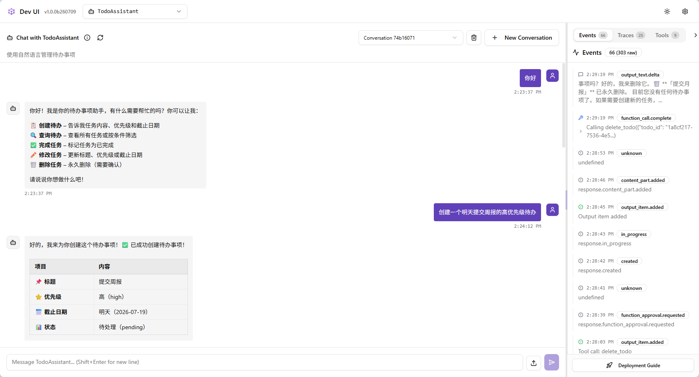
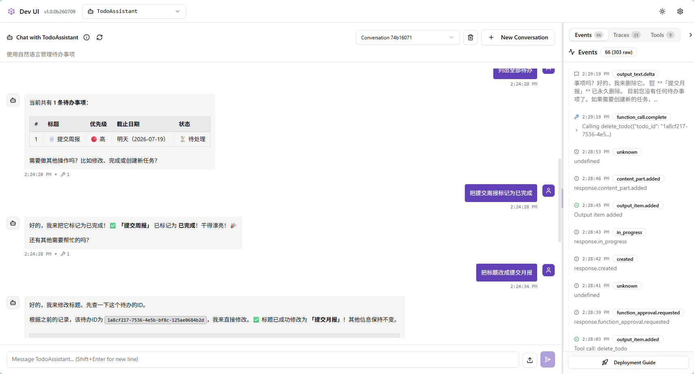
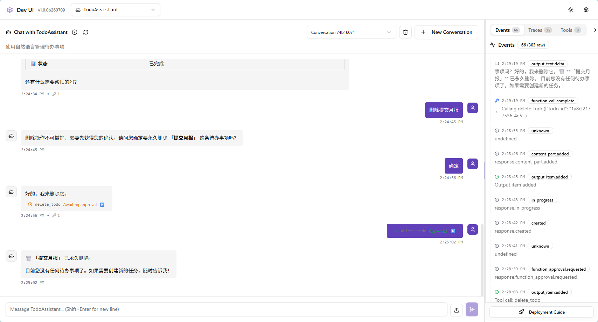
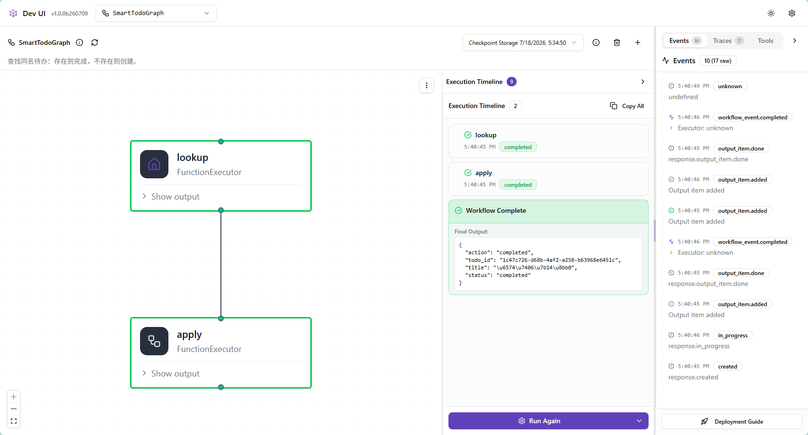

# 目录结构

```txt

todo-microsoft-agent/
├── app/
│   ├── __init__.py
│   ├── domain/
│   ├── repositories/
│   ├── services/
│   ├── agent/
│   ├── workflows/
│   ├── api/
│   └── static/
├── tests/
├── .env
├── .env.example
├── .gitignore
├── pyproject.toml
└── main.py

```

各目录职责：
- domain：todo 数据模型和业务枚举
- repositories：数据保存与查询
- services：确定性业务规则
- agent：MAF 客户端，工具和Agent
- workflows：批量、并行、条件流程
- api：FastAPI 与 SSE
- static：聊天页面
- tests：不依赖真实模型的测试

## 创建环境并运行

```txt
cd ".....\src"

# 1. 创建虚拟环境(默认 .venv)
uv venv --python 3.11 # 如果默认用最新版本python：uv venv

# 2. 激活 (可选； 也可不加激活，直接用 uv run)
.\.venv\Script\Activate.ps1

# 3. 按 pyproject.toml 安装目录 + 开发依赖
uv sync --extra dev

# 4. 准备环境变量
Copy-Item .env.example .env
# 编辑 .env, 填写真实API Key

# 5. 运行方式任选其一：

# 方式A：已激活 .venv
python main.py

# 方式B：不激活，推荐日常使用
uv run python main.py
```

## Agent vs Workflow

|  | Agent | Workflow |
| -- | -- | -- |
| 决策方式 | 模型动态选工具 | 你写死的执行顺序 |
| 适合 | 开放式对话 | 固定业务步骤 |
| 示例 | "帮我整理下待办" | 查今日待办 -> 并行统计 -> 汇总 |

**Todo项目中两者并存： 日常对话用Agent；**





## Functional Workflow(函数式工作流)

**知识点：**

- @workflow: 把普通async 函数变成可 .run()的 Workflow
- 输入的第一个参数；返回值自动作为output
- asyncio.gather：官方推荐的并行写法(Functional API)

## Functional Workflow vs Graph WorkflowBuilder

| Functional @workflow | Graph WorkflowBuilder |
| -- | -- |
| 一个 async 函数里写 if | 多个 exector + add_edge |
| 适合快速原型 | 适合固定拓扑、DevUI原生发现 |

**关键API：**
- @executor: 图上的处理节点
- ctx.send_message(...)：发给下游节点
- ctx.yield_output(...)：工作流最终输出
- WorkflowBuilder(...).add_edge(...).build()：组装图
- 



## 已学知识点回顾
| 概念 | 关键 API|
| -- | -- |
| 挂起工作流 | await ctx.request_info(data, type, request_id=...) |
| 读取挂起状态 | result.get_final_state() == WorkflowRunState.IDLE_WITH_PENDING_REQUESTS |
| 读取挂起的请求 | result.get_request_info_events() |
| 拒绝/同意恢复 | workflow.run(responses={"request_id": True/False}) |

## Context Provider - 上下文提供程序

### 核心作用：解决"记忆"与"知识"问题

- 长期/外部记忆：让智能体"记住"用户偏好或从外部知识库(如数据库，搜索引擎)检索信息。
- 动态上下文注入：在每次对话前，动态添加指令、工具或数据，以影响智能体的行为。

问题场景：TodoAgent 的 instructions 是硬编码字符串，Agent 不知道今天是几号。用户说"明天到期"，靠的是 TodoService.parse_due_date() 在工具层解析——但如果用户问"今天有什么待办"，模型就不知道"今天"是哪一天。

解决方案：ContextProvider.before_run() 在每次模型调用前注入动态上下文，不污染静态instructions(指智能体初始化时硬编码写死的，在运行过程中不会动态改变的系统提示词)

```txt

每次 AgentSession.send_message()
        │
        ▼
ContextProvider.before_run() <- 注入今日日期、用户名等
        │
        ▼
    模型推理
        │
        ▼
ContextProvider.after_run() <- 可选：处理响应、存数据
```
**本节完整知识点 执行时序**

```txt

agent.run(msg, session=session)
        │
        ├─ TodayDateProvider.before_run()  → extend_instructions("今天是 2026-07-22")
        ├─ UserNameProvider.before_run()   → extend_instructions("用户是小明")
        │
        ▼
   模型推理（拿到拼装后的 instructions）
        │
        ▼
   ContextProvider.after_run()   ← 本节未用，下节讲

```

**三个核心方法**
| 方法 | 用途 |
| context.extend_instructions(source_id, text) | 追加系统级提示词 |
| context.extend_messages(source_id, messages) | 注入历史消息（如摘要、示例）|
| context.extend_tools(source_id, tools) | 动态注入工具（按会话权限控制）|

**state 字典（跨轮次）**
before_run / after_run 都收到 state: dict，这个字典在同一个 Provider 实例的生命周期内跨轮次保留，可以用来做计数、缓存等：

```python

async def before_run(self, *, agent, session, context, state):
    state["call_count"] = state.get("call_count", 0) + 1
    context.extend_instructions(self.source_id, f"这是第 {state['call_count']} 次对话。")

```

## Middleware 中间件

**一种强大的可插拔机制，允许你在Agent执行的不同阶段"拦截"、检查和修改其行为** 理解为 Agent处理流程中的"拦截器"或"过滤器"

中间件来做什么：

- 日志与监控：记录每一次Agent调用的请求和响应，用于调试与性能监控。
- 安全与校验：在请求到达核心逻辑前，验证输入内容是否包含敏感信息，或检查调用者权限。
- 错误处理：集中捕获Agent或工具调用过程中的异常，并执行重试、降级或返回友好的错误信息。
- 结果转换：在Agent生成最终回复前，对结果进行格式化或添加额外信息。
- 注入上下文：在请求被处理前，向其中注入额外的系统提示或消息。

### 中间件的类型

提供了三种不同类型的中间件，以实现在不同层面进行拦截：

1. Agent运行中间件(Agent Run Middleware)
   - 拦截目标：整个Agent的 run() 方法调用。
   - 作用范围：最顶层，包裹 Agent 的整个执行过程，包括上下文解析和后续的LLM调用。
   - 适用场景：对请求和响应进行全局性的日志记录、性能监控、权限校验等。
2. 函数调用中间件(Function Calling Middleware)
   - 拦截目标：Agent执行的每一个工具/函数调用
   - 作用范围：工具调用层，位于Agent和具体工具函数之间
   - 适用场景：记录工具调用的详细参数和返回值，对工具调用进行超时控制、结果缓存或错误统一处理。   
3. 聊天中间件(IChatClient Middleware / Chat Middleware)
   - 拦截目标：对底层LLM聊天客户端(IChatClient)的调用
   - 作用范围：最底层，位于Agent和LLM API之间。
   - 适用场景：在请求发送给LLM前修改消息队列(如动态注入系统提示)，或对LLM的原始响应进行处理。

```txt

agent.run(msg)
    │
    ▼
AgentMiddleware <- 整个 Agent 循环(含多轮工具调用)
    │
    ▼
ChatMiddleware <- 单次模型 HTTP 请求
    │
    ▼
FunctionMiddleware <- 单次工具函数调用 <- 今天重点

```

**FunctionMiddleware** 最实用：工具调用前后可以做日志、计时、权限拦截、完全不改工具代码本身。
两种写法都支持：
    - 装饰器 @function_middleware：一个异步函数，适合简单逻辑
    - 类 class Xxx(FunctionMiddleware)：需要构造函数参数时用


### 中间件 vs. 上下文提供程序 (Context Provider)

为了帮你更好地区分，这里做一个对比：

特性	中间件 (Middleware)	上下文提供程序 (Context Provider)
核心目的	拦截和修改 Agent 的行为与数据流	提供和注入额外的上下文信息
作用方式	像一个包装器，包裹住执行过程	像一个数据源，在执行前被调用来获取数据
触发时机	在 Agent 执行前后都可以介入	主要在 LLM 调用之前运行
典型用途	日志、鉴权、错误处理、结果转换	长期记忆、动态指令、RAG 检索结果
灵活性	可以修改输入和输出，甚至中止执行	主要负责添加信息，不直接修改用户输入
简单来说：上下文提供程序负责“准备什么”信息，而中间件负责“怎么处理”这些信息和整个流程。

### Instructions(agent的系统提示(System Prompt)) vs Middleware

**Middleware是安全网，不是第一道防线**

| 层次 | 作用 | 本次表现 |
| -- | -- | -- |
| instructions | 告诉模型"能做什么" | 模型自觉不调用写工具 |
| ReadOnlyGuardMiddleware | 兜底拦截(模型绕过时) | 本次未触发 |

真正需要Middleware 兜底的场景：
- 模型幻觉(该拒绝却调用了)
- 工具被直接调用(绕过模型，如测试脚本)
- 多个Agent共享同一套工具，权限因调用方不同而异。


## Checkpoint 持久化

HITL，run(payload)挂起后，挂起状态只活在内存里--进程一重启，状态就没了。

Checkpoint把挂起状态序列化到尾部存储(文件/内存)，用checkpoint_id索引。进程重启后可以用checkpoint_id精确恢复。

```txt
进程 A：run(payload) -> 挂起 -> 存 checkpoint -> 返回 checkpoint_id
进程 A 退出

进程 B：run(checkpoint_id=..., response={...}) -> 从 checkpoint 恢复继续执行

```

MAF 内置两种存储：

| 类 | 用途 |
| -- | -- |
| InMemoryCheckpointStorage | 测试/同一进程内演示 |
| FileCheckpointStorage(path) | 持久化到磁盘，跨进程恢复 |

### 关键参数说明

| 参数 | 说明 |
| -- | -- |
| checkpoint_storage=storage | 传给run(), 框架自动在挂起时保存 |
| checkpoint_id=... | 传给第二次run(), 框架从存储加载后继续 |
| allowed_checkpoint_types | 自定义的dataclass需要在这里声明，否则反序列化时被拒绝 |

### 总结

| 概念 | 要点 |
| -- | -- |
| checkpoint_storage=storage | 传给run(), 框架在 request_info 挂起时自动保存 |
| checkpoint_id=... | 传给第二次run(), 从存储加载后继续执行 |
| InMemoryCheckpointStorage | 同进程测试用，简单 |
| FileCheckpointStorage(path) | 磁盘持久化，跨进程恢复 |
| allowed_checkpoint_types | 自定义dataclass需要声明, 格式"模块:类名" |
| 重放语义 | 恢复时从头重放函数, request_info之前的代码会再次执行 |
| 设计约束 | 跨进程 checkpoint 必须配合持久化的业务存储，不能用内存存储 |